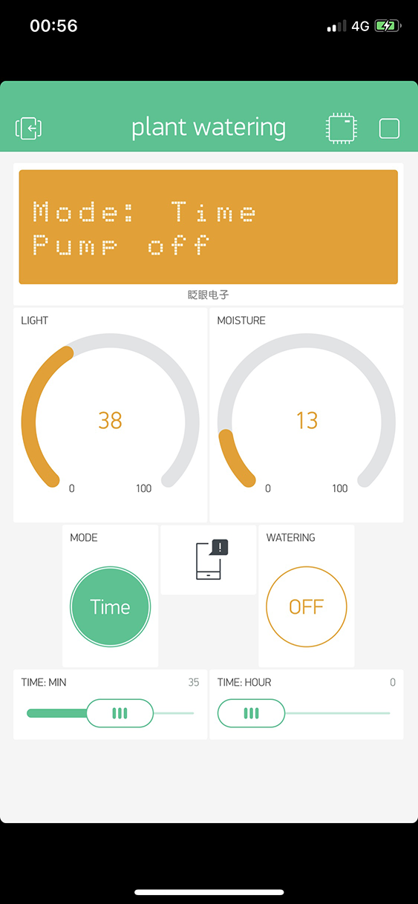

#  Welcome
สวัสดีครับ เราได้จัดทำเครื่องรดน้ำต้นไม้อัตโนมัติขึ้น เพื่อที่ทำให้การดูแลต้นไม้นั้นง่ายขึ้น ทำเองได้ผ่าน Smartphone

และสามารถตั้งเวลาให้รดน้ำต้นไม้เองได้อีกด้วย ปัจจัยที่ทำให้เครื่องนั้นจะรดน้ำต้นไม้ มีทั้งความชื้น และอุณหภูมิ

สามารถตั้งค่าเองได้ง่ายๆครับ

#  How to use
วิธีใช้นั้นง่าย ๆ ครับ ต่อถ่านไฟฉายขนาด 9V ก้อนแรกกับบอร์ด Wemos D1R1 อีกก้อนต่อกับ Water Pump

เท่านี้เครื่องรดน้ำต้นไม้อัตโนมัติก็จะทำงานตามโปรแกรมที่สั่งไว้แล้วครับ

แต่ถ้าอยากปรับค่าตามสภาพแวดล้อมต่าง ๆ ก็สามารถแก้ไขได้ผ่านไฟล์ Motor_control.ino

หรือถ้าอยากควบคุมระยะไกล ก็สามารถใช้ application ที่ชื่อว่า Blynk (สามารถใช้ได้ทั้งระบบปฏิบัติการ Android และ IOS ครับ)

*แต่จำเป็นต้องต่ออินเทอร์เน็ตกับบอร์ดผ่าน Wifi ด้วยครับ

#  Application Blynk
ในส่วนของ application ที่ใช้ ชื่อว่า Blynk นั้น สามารถควบคุมการเปิด - ปิดของ water pump ได้

มีหน้าจอ Monitor ไว้บอกค่าของแสง ณ บริเวณนั้น และความชื้นในดิน บอกเป็นเปอร์เซ็นต์

สามารถตั้งเวลาที่เราจะรดน้ำต้นไม้ได้ผ่านแอป Blynk โดยใช้ Mode Time

ตั้งให้ water pump ทำงานไว้ เช่น ตั้งให้ทุก ๆ 8 ชั่วโมงจะรดน้ำต้นไม้ของเรา

#  Library Requirements
* [Blynk Library](https://github.com/blynkkk/blynk-library)
* [LineNotify Library](https://github.com/TridentTD/TridentTD_LineNotify)
* [ADS1X15 Library](https://github.com/adafruit/Adafruit_ADS1X15)
* [Time Library](https://github.com/PaulStoffregen/Time)

#  Tools
* WeMos D1R1 WiFi UNO Development Board ESP8266
* I2C ADS1015 12-Bit ADC - 4 Channel
* 1 Channel Relay
* Soil Moisture Sensor
* Water Pump 6V
* Battery 9V (2 ea)
* Breadboard

#  Members
|  |ชื่อ|นามสกุล|GitHub Username|รหัสนักศึกษา|
|:-:|--|------|---------------|---------|
||Peerapol|Onhan|[@pumy2517](https://github.com/pumy2517)|60070067|
||Pattarapong|Intubtim|[@mezz3](https://github.com/mezz3)|60070070|

#  Assistant Teacher
|ผศ.ดร. กิติ์สุชาติ พสุภา|ผศ.ดร. ปานวิทย์ ธุวะนุติ|
|:-:|:-:|
|||

รายงานนี้เป็นส่วนหนึ่งของวิชา Computer Programming (รหัส 06016206)

คณะเทคโนโลยีสารสนเทศ สถาบันเทคโนโลยีพระจอมเกล้าเจ้าคุณทหารลาดกระบัง
